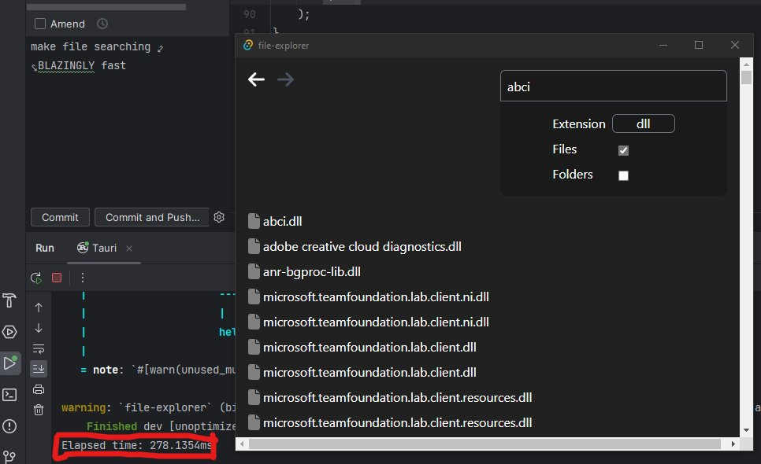

# Fast File Explorer
This is a fast file explorer written in Rust. After testing on my C drive, this file explorer was able to find a file in 280ms. In comparison, Windows took 3 minutes and 45 seconds.

## Supported operating systems
- Windows

Bear in mind this is still in development and missing the following core features:
- Caching service (constant file watching to keep cache up to date) - only works when program is open
- Top navigation bar
- Search/caching progress counter
- Ability to search for file extensions without including any name
- Ability to copy/cut/paste files
- Ability to move files
- Ability to create files

